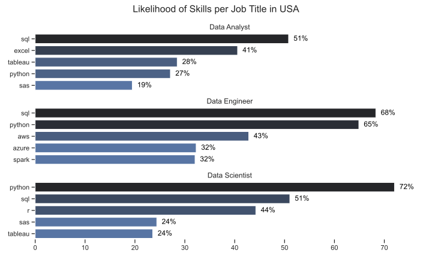
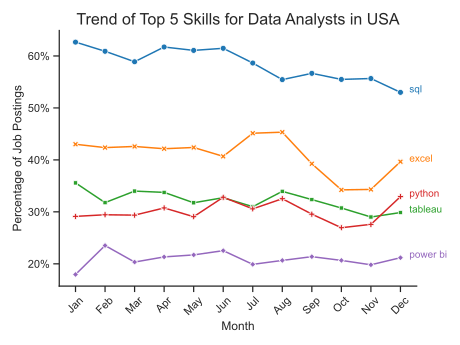
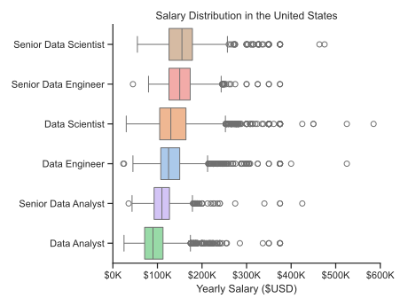
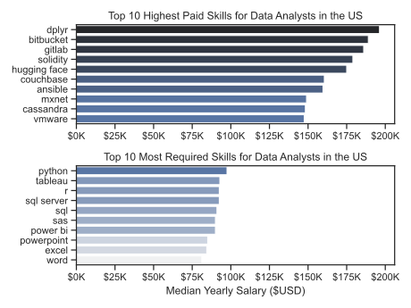
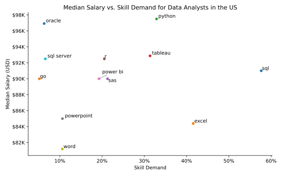

# Le analisi

# 1. Quali sono le competenze più richieste per i top 3 titoli di lavoro sui dati negli USA?

Per trovare le competenze più richieste per i top 3 titoli di lavoro sui dati negli USA, abbiamo prima contato il numero di competenze associate a ciascun titolo di lavoro. Successivamente, abbiamo calcolato la percentuale di ogni competenza rispetto al totale dei lavori per quel titolo. Infine, abbiamo visualizzato i risultati con un grafico a barre che mostra la percentuale di ogni competenza per i top 5 lavori associati a ciascun titolo di lavoro.

Puoi vedere il codice completo e i risultati nella sezione [2_Skills_Count.ipynb](3_Progetto/2_Skills_Count.ipynb).

```python
sns.set_theme(style='ticks')
fig, ax = plt.subplots(len(job_titles), 1, figsize=(10, 6))
for i, job_title in enumerate(job_titles):
    df_plot = df_skills_perc[df_skills_perc['job_title_short'] == job_title].head(5)
    sns.barplot(x='skill_perc', y='job_skills', data=df_plot, ax=ax[i], hue='skill_perc', palette = 'dark:b_r', legend=False)
    sns.despine(left=True, bottom=True)
    ax[i].set_title(job_title)
    ax[i].set_xlabel('')
    ax[i].set_ylabel('')
    ax[i].set_xlim(0, 78)
    
    if i < len(job_titles) - 1:
        ax[i].set_xticks([])
    for n, v in enumerate(df_plot['skill_perc']):
        ax[i].text(v + 1, n, f'{v:.0f}%', color='black', va='center')
fig.suptitle('Likelihood of Skills per Job Title in USA', fontsize=16)
fig.tight_layout(h_pad=1)
```



Insight Principali:
- **Il predominio di SQL e Python**: SQL è la competenza più richiesta per i Data Engineer (68%) e i Data Analyst (51%), mentre Python domina incontrastato per i Data Scientist con una percentuale del 72%. Questi due linguaggi si confermano le fondamenta essenziali dell'ecosistema dati.
- **Differenze nei tool secondari**: i Data Analyst fanno grande affidamento su Excel (41%) e strumenti di BI come Tableau, mentre i Data Engineer si focalizzano su infrastrutture cloud come AWS (43%) e tecnologie per big data come Spark.
- **Sovrapposizione tra Data Scientist e Data Analyst**: Solo per i Data Scientist e i Data Analyst compaiono linguaggi orientati all'analisi statistica pura come R (44%) e SAS, evidenziando una sovrapposizione tra questi due ruoli che invece non compare nel profilo più tecnico e infrastrutturale del Data Engineer.

# 2. Qual è il trend di crescita delle competenze più richieste per i Data Analyst negli USA?

Per analizzare il trend di crescita delle competenze più richieste per i Data Analyst negli USA, abbiamo calcolato la percentuale di ogni competenza rispetto al totale dei lavori per i Data Analyst in ogni mese. Successivamente, abbiamo visualizzato i risultati con un grafico a linee che mostra l'andamento delle top 5 competenze nel tempo.

```python
df_plot = df_DA_US_perc.iloc[:, :5]
sns.lineplot(data=df_plot, markers=True, palette='tab10', dashes=False)
sns.set_theme(style='ticks')
sns.despine() # rimuove le spine per un look più pulito
plt.title('Trend of Top 5 Skills for Data Analysts in USA', fontsize=16)
plt.xlabel('Month', fontsize=12)
plt.ylabel('Percentage of Job Postings', fontsize=12)
for i in range(5):
    plt.text(11.3, df_plot.iloc[-1, i], df_plot.columns[i], color=sns.color_palette('tab10')[i], fontsize=10)
ax = plt.gca()
ax.yaxis.set_major_formatter(PercentFormatter(decimals=0))
plt.legend().remove()
plt.xticks(rotation=45)
plt.tight_layout()
```



Insight Principali:
- **Dominio incontrastato di SQL**: SQL si conferma la competenza più richiesta per tutto l'anno, mantenendosi costantemente sopra la soglia del 50% delle offerte di lavoro. Nonostante una leggera flessione verso fine anno, resta il requisito fondamentale del settore.
- **Stabilità e crescita di Excel**: Excel occupa saldamente la seconda posizione. È interessante notare il trend positivo nell'ultimo trimestre (da ottobre a dicembre), dove recupera terreno suggerendo che la padronanza dei fogli di calcolo rimane un pilastro imprescindibile accanto a linguaggi più complessi.
- **Competizione tra Python e Tableau**: Queste due competenze mostrano un andamento quasi sovrapponibile per gran parte dell'anno, oscillando tra il 25% e il 35%. Ciò indica che per un Data Analyst la capacità di programmazione (Python) e quella di visualizzazione dati (Tableau) hanno un peso specifico molto simile sul mercato.
- **Power BI in crescita costante**: Sebbene sia all'ultimo posto tra le "Top 5", Power BI mostra una crescita graduale e una maggiore stabilità rispetto alla volatilità di Python. Questo suggerisce una crescente adozione degli strumenti dell'ecosistema Microsoft nelle aziende americane.

# 3. Quando bene sono pagati i diversi lavori e le diverse skill?

## 3.1 Analisi per i top 6 lavori più pagati negli USA
Per analizzare quanto bene sono pagati i diversi lavori, abbiamo filtrato il dataset per i lavori negli USA e abbiamo selezionato i top 6 titoli di lavoro più pagati. Successivamente, abbiamo calcolato la retribuzione mediana per ciascun titolo di lavoro e abbiamo visualizzato i risultati con un grafico a barre ordinato in base alla retribuzione mediana.

```python
df_plot = df_DA_US_perc.iloc[:, :5]
sns.lineplot(data=df_plot, markers=True, palette='tab10', dashes=False)
sns.set_theme(style='ticks')
sns.despine() # rimuove le spine per un look più pulito
plt.title('Trend of Top 5 Skills for Data Analysts in USA', fontsize=16)
plt.xlabel('Month', fontsize=12)
plt.ylabel('Percentage of Job Postings', fontsize=12)
for i in range(5):
    plt.text(11.3, df_plot.iloc[-1, i], df_plot.columns[i], color=sns.color_palette('tab10')[i], fontsize=10)
ax = plt.gca()
ax.yaxis.set_major_formatter(PercentFormatter(decimals=0))
plt.legend().remove()
plt.xticks(rotation=45)
plt.tight_layout()
```


Insight Principali:

- **Gerarchia dei ruoli Senior**: I ruoli "Senior" (Data Scientist, Data Engineer, Data Analyst) mostrano costantemente una mediana salariale più alta e un range interquartile più ampio rispetto alle loro controparti junior, confermando che l'esperienza è un fattore determinante per l'incremento retributivo.
- **Vantaggio economico dei Data Scientist**: Il ruolo di Senior Data Scientist emerge come il più remunerativo, con la mediana più alta e una distribuzione che si spinge frequentemente verso i $300k - $400k, superando leggermente i Senior Data Engineer.
- **Presenza di Outlier elevati**: Tutti i ruoli analizzati presentano numerosi "outlier" (valori anomali) nella fascia alta, con punte che raggiungono i $600k per i Data Scientist. Questo indica che, sebbene la maggior parte degli stipendi si concentri tra $100k e $200k, esiste una fetta di mercato "top-tier" con compensi eccezionalmente elevati.

## 3.2 Analisi per le skill più pagate per i Data Analyst negli USA

Per analizzare quanto bene sono pagate le diverse skill per i Data Analyst negli USA, abbiamo filtrato il dataset per i lavori di Data Analyst negli USA e abbiamo esploso la colonna delle competenze. Successivamente, abbiamo calcolato la retribuzione mediana per ciascuna competenza e abbiamo visualizzato i risultati con un grafico a barre ordinato in base alla retribuzione mediana.

```python
fig, axes = plt.subplots(2, 1)
sns.set_theme(style="ticks")

sns.barplot(data=df_DA_top_pay, x='median', y=df_DA_top_pay.index, ax=axes[0], hue='median', palette='dark:b_r')
axes[0].set_title("Top 10 Highest Paid Skills for Data Analysts in the US")
axes[0].legend_.remove() # rimuove la legenda
axes[0].set_ylabel("")
axes[0].set_xlabel("")
axes[0].xaxis.set_major_formatter(FuncFormatter(lambda x, _: f'${int(x/1000)}K')) # formatta l'asse x per mostrare i salari in migliaia di dollari


sns.barplot(data=df_DA_top_skills, x='median', y=df_DA_top_skills.index, ax=axes[1], hue='median', palette='light:b')
axes[1].set_title("Top 10 Most Required Skills for Data Analysts in the US")
axes[1].legend_.remove() # rimuove la legenda
axes[1].set_ylabel("")
axes[1].set_xlabel("Median Yearly Salary ($USD)")
axes[1].xaxis.set_major_formatter(FuncFormatter(lambda x, _: f'${int(x/1000)}K')) # formatta l'asse x per mostrare i salari in migliaia di dollari
axes[1].set_xlim(axes[0].get_xlim()) # allinea l'asse x del secondo grafico a quello del primo
fig.tight_layout()
```



Insight Principali:

- **Discrepanza tra Popolarità e Retribuzione**: Esiste una netta separazione tra le skill "standard" e quelle "lucrative". Le competenze più richieste (Python, Tableau, SQL) hanno stipendi medi che si aggirano tra gli $80k e i $100k, mentre le skill di nicchia o specialistiche superano facilmente i $150k, arrivando quasi a $200k con dplyr.
- **Il Valore della Nicchia Tecnica**: Le skill meglio pagate appartengono a settori specifici come lo sviluppo software/DevOps (bitbucket, gitlab, ansible), il Web3 (solidity) o l'AI avanzata (hugging face). Questo suggerisce che un Data Analyst che "ibrida" le proprie competenze con l'ingegneria del software o la blockchain ottiene un premio salariale altissimo.
- **Saturazione delle Skill di Base**: Competenze come Excel, PowerPoint e Word sono ancora tra le prime 10 per richiesta, ma sono le meno pagate della lista (sotto i $90k). Questo indica che sono considerate "requisiti minimi" e non offrono potere contrattuale per stipendi elevati.
- **Predominanza dell'Ecosistema R per l'Analisi Avanzata**: È interessante notare che, sebbene Python sia la skill più richiesta in assoluto, è la libreria di R "dplyr" a guidare la classifica degli stipendi. Ciò suggerisce che, per ruoli di analisi statistica pura e complessa, la specializzazione in R può essere finanziariamente più vantaggiosa rispetto alla conoscenza generalista di Python.

# 4. Qual è la competenza più ottimale da acquisire per un analista di dati? 

Abbiamo raggruppato le competenze per determinare lo stipendio mediano e la probabilità di essere inclusi nell'annuncio. Successivamente, abbiamo visualizzato lo stipendio mediano rispetto alla percentuale di domanda di competenze con un grafico a dispersione, aggiungendo etichette per ogni punto usando la libreria adjustText per evitare sovrapposizioni.

```python
%config InlineBackend.figure_format = 'retina'
from adjustText import adjust_text

# Ingrandiamo la figura per dare più spazio alle etichette
plt.figure(figsize=(8, 5))

# Scatterplot
sns.scatterplot(data=df_DA_skills_hight_demand, y='median_salary', x='skill_percent', hue=df_DA_skills_hight_demand.index, palette='tab10')
sns.despine()

plt.title('Median Salary vs. Skill Demand for Data Analysts in the US')
plt.xlabel('Skill Demand')
plt.ylabel('Median Salary (USD)')
plt.legend().remove()

# Aggiunta di etichette per ogni punto usando adjustText
texts = []
for i, row in df_DA_skills_hight_demand.iterrows():
    texts.append(plt.text(row['skill_percent'], row['median_salary'], i)) # type: ignore

# adjust_text funziona meglio se ha abbastanza spazio. Torniamo a valori più conservativi o default.
adjust_text(texts, 
            arrowprops=dict(arrowstyle='->', color='grey', lw=0.8))

ax = plt.gca()
ax.xaxis.set_major_formatter(FuncFormatter(lambda x, _: f'{x:.0f}%')) # formatta l'asse x per mostrare le percentuali
ax.yaxis.set_major_formatter(FuncFormatter(lambda x, _: f'${int(x/1000)}K')) # formatta l'asse y per mostrare i salari in migliaia di dollari

plt.tight_layout()
```



Insight Principali:

1. **Python è il "Gold Standard"**: Python si posiziona nell'angolo in alto a destra del quadrante ottimale. Combina una domanda elevata (oltre il 30%) con uno dei salari medi più alti del dataset (vicino ai $98K). È chiaramente la competenza più remunerativa tra quelle ad alta diffusione.
2. **SQL: Alta Domanda, Salario Competitivo**: SQL è la competenza più richiesta in assoluto, apparendo in quasi il 60% delle offerte di lavoro. Sebbene il salario medio (circa $91K) sia leggermente inferiore a quello di Python o Oracle, la sua ubiquità la rende una competenza fondamentale e imprescindibile per entrare nel mercato.
3. **Strumenti Office: Bassa Specializzazione, Basso Salario**
Esiste una correlazione chiara tra la semplicità degli strumenti e la retribuzione. Excel, PowerPoint e Word si trovano nella parte bassa del grafico. Nonostante Excel sia molto richiesto (oltre il 40%), offre il salario tra i più bassi (circa $84K), indicando che queste sono considerate "competenze di base" piuttosto che specialistiche.
4. **Il valore della Visualizzazione Dati (Tableau vs Power BI)** Il grafico mostra un vantaggio competitivo per Tableau rispetto a Power BI. Tableau non solo ha una domanda leggermente superiore (circa 32% contro 20%), ma garantisce anche un salario medio più alto (circa $93K contro $90K), suggerendo che il mercato attuale premi maggiormente la specializzazione nell'ecosistema Tableau.